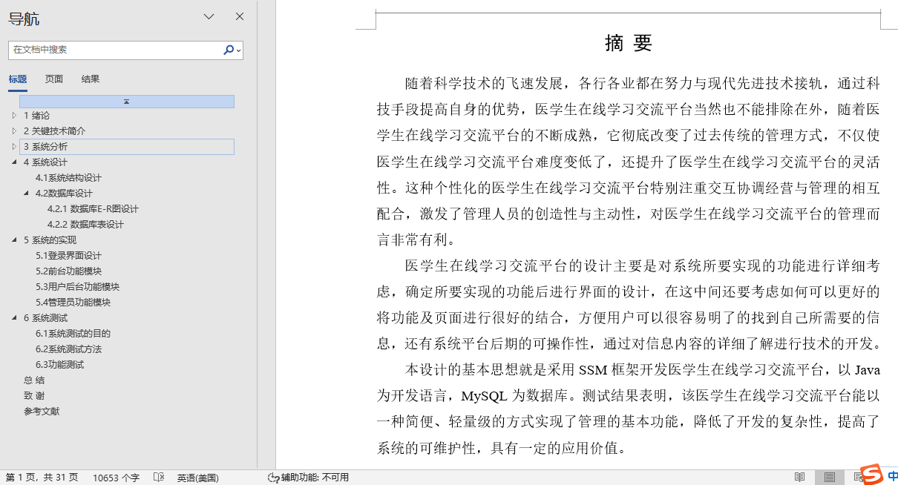
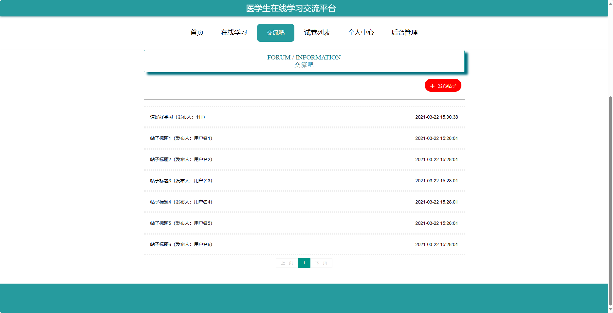
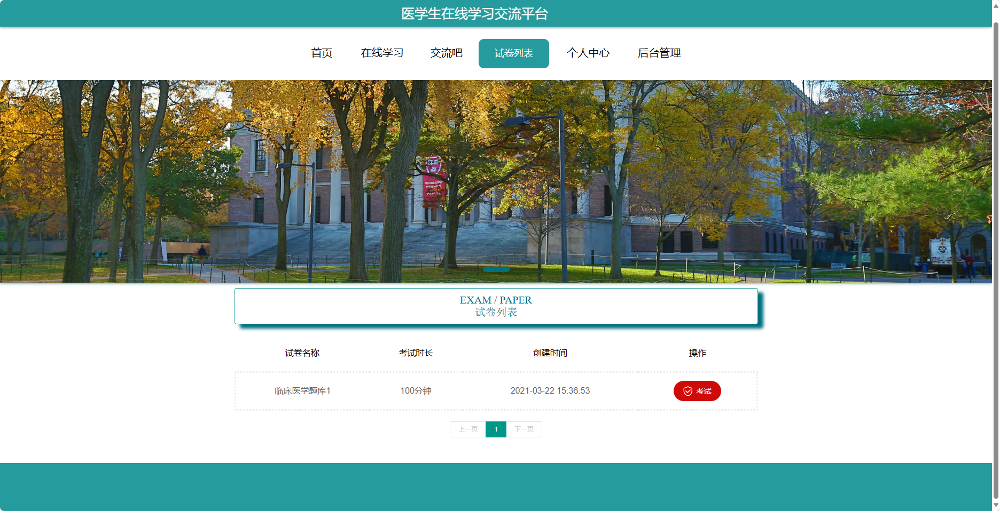
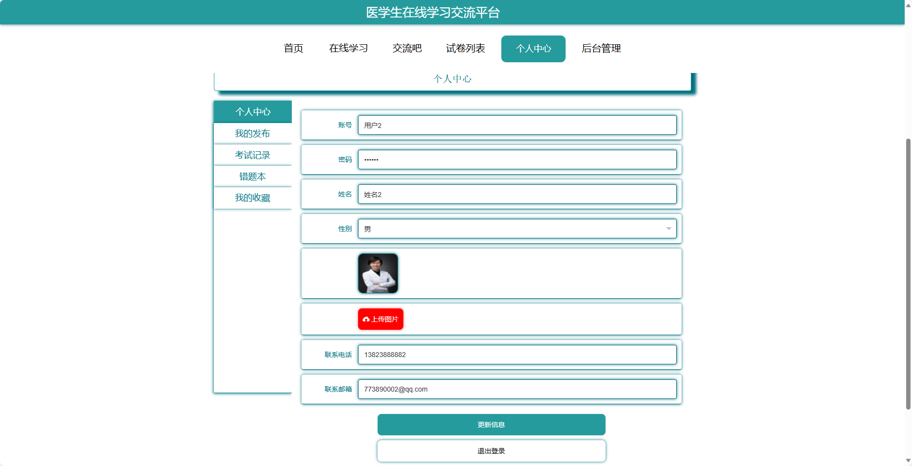
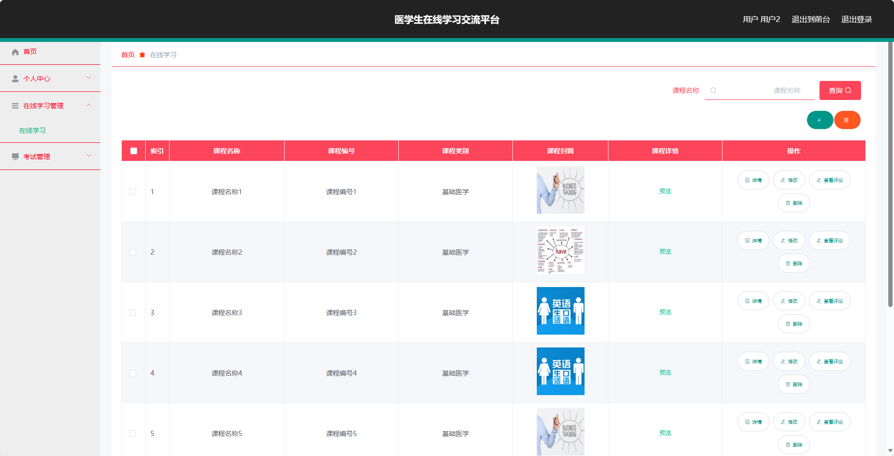
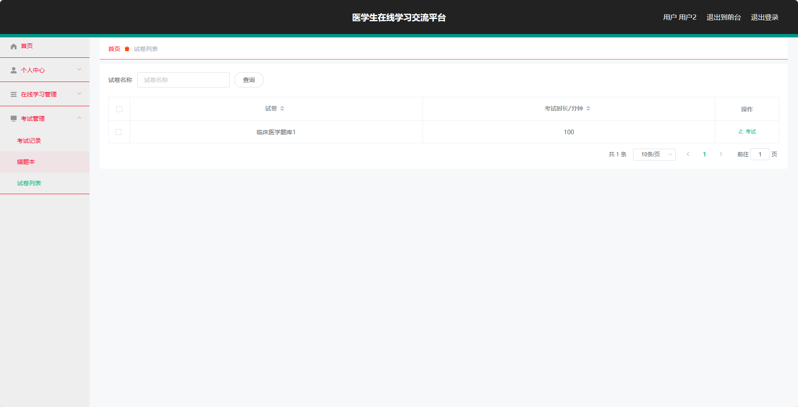
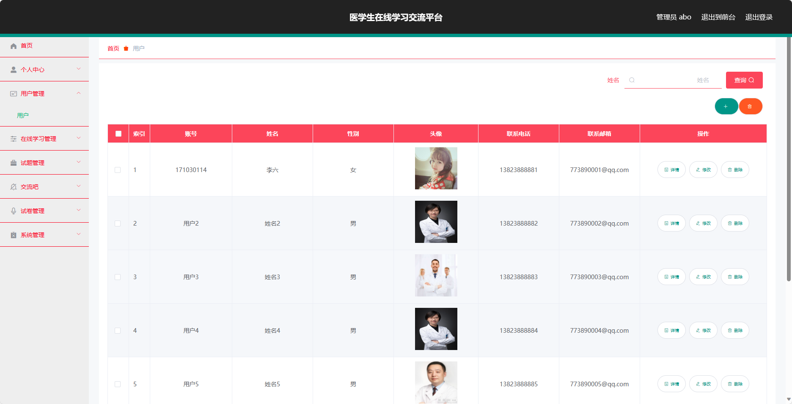
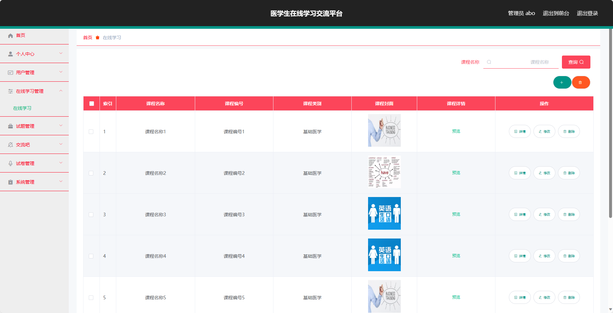
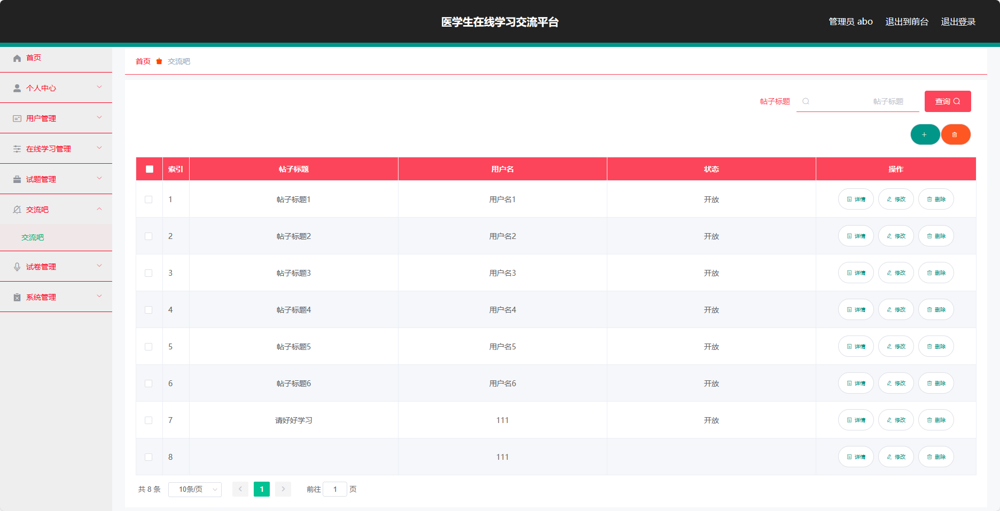

## 基于SSM框架实现的医学生在线学习交流平台(程序+报告)

###  获取sql数据库文件: 从戎源码网 (https://armycodes.com/) QQ: 386869957 QQ群: 377586148
###  所有系统地址: (https://github.com/YuLin-Coder/AllProjectCatalog) 
###  所有项目以及源代码本人均调试运行无问题 可支持远程安装部署调试、定制修改、代码讲解

## 项目介绍
基于SSM框架实现的医学生在线学习交流平台，系统包含两种角色：管理员、用户,系统分为前台和后台两大模块，主要功能如下。
前台：
1. 在线学习：提供医学生在线学习的功能，包括课程视频、教材资料等学习资源的在线播放和下载。
2. 交流吧：为医学生提供一个交流讨论的平台，可以发布问题、回答问题以及参与讨论。
3. 试卷列表：提供医学生可以查看和下载各科目的试卷，方便复习和自测。
4. 个人中心：为用户提供个人信息管理、学习进度查看、成绩记录等功能。

后台-用户：
1. 个人中心：提供用户个人信息管理、学习进度查看、成绩记录等功能。
2. 在线学习管理：管理在线学习模块的课程、教材、视频等资源，包括添加、编辑、删除等操作。
3. 考试管理：管理医学生的考试内容，包括试题的发布、编辑、删除等操作。
4. 考试记录：记录医学生的考试成绩和考试记录，方便用户查看和分析。
5. 错题本：记录用户做错的试题，方便用户进行错题复习。
6. 试卷列表：管理各科目的试卷，包括试卷的添加、编辑、删除等操作。

后台-管理员：
1. 个人中心：提供管理员个人信息管理、权限管理等功能。
2. 用户管理：管理系统中的用户，包括用户的添加、编辑、删除等操作。
3. 在线学习管理：管理在线学习模块的课程、教材、视频等资源，包括添加、编辑、删除等操作。
4. 试题管理：管理医学生的试题，包括试题的添加、编辑、删除等操作。
5. 交流吧：管理医学生的交流讨论区，包括帖子的审核、删除等操作。
6. 试卷管理：管理各科目的试卷，包括试卷的添加、编辑、删除等操作。
7. 系统管理：管理系统的基本配置信息，

## 项目技术
- 编程语言：Java
- 数据库：MySQL
- 前端技术：vue、html、JavaScript
- 后端技术：Spring、SpringMVC、MyBatis

## 运行环境
- JDK版本：JDK1.8及以上
- 开发工具：IDEA、Ecplise、Myecplise都可以
- 数据库: MySQL5.7及以上

## 运行截图

